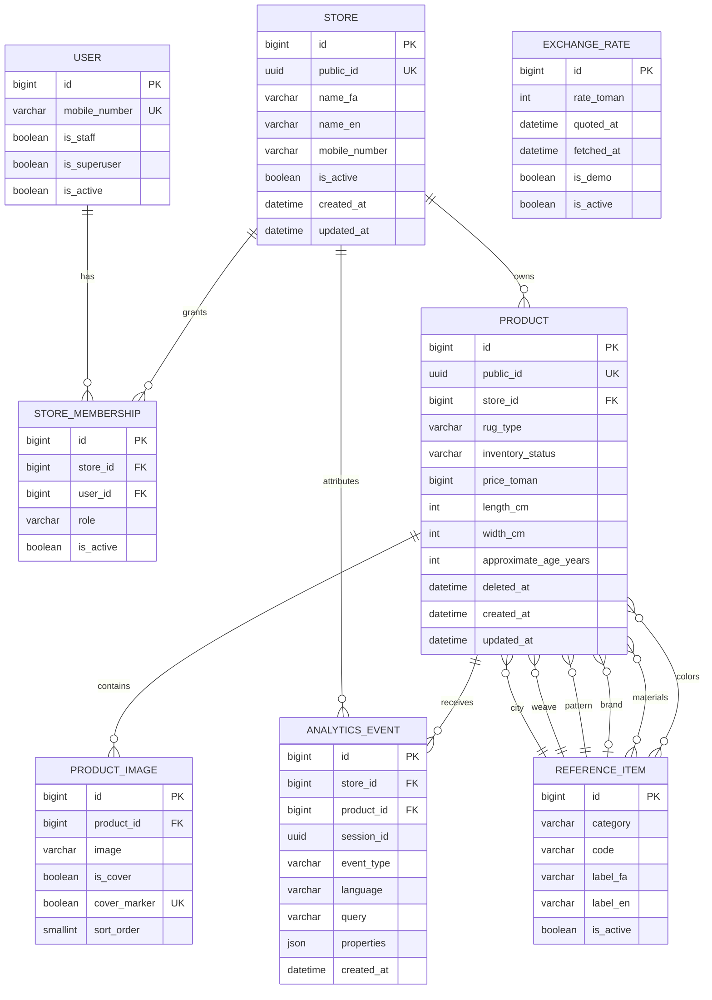

# معماری دیتابیس Carpet Market

این schema برای MySQL 8 با `InnoDB` و `utf8mb4` طراحی شده و با PostgreSQL و SQLite توسعه نیز سازگار است. هدف آن حفظ نیازهای V1 تک‌فروشنده و جلوگیری از بازطراحی پرریسک هنگام حرکت به Multi-vendor در V2 است.

## مرز مالکیت و دسترسی

- `StoreMembership` رابطه چندبه‌چند User و Store را با نقش `owner` یا `manager` نگه می‌دارد.
- تمام queryهای پنل و Dashboard بر اساس Storeهای قابل مدیریت کاربر scope می‌شوند؛ Superuser دسترسی سراسری دارد.
- `Product.store_id` مالک قطعی محصول است و `AnalyticsEvent.store_id` انتساب KPI و گزارش را شفاف می‌کند.
- رویداد محصول همیشه Store خود محصول را می‌گیرد. رویداد عمومی در حالت یک فروشگاه خودکار منتسب می‌شود و در حالت چندفروشگاهی باید `store_public_id` داشته باشد.

## قواعدی که دیتابیس تضمین می‌کند

- مقادیر `rug_type`، `condition`، `inventory_status`، دسته Reference، نقش Membership، زبان و نوع Event فقط از مجموعه مجاز هستند.
- قیمت و ابعاد مثبت و قدمت نامنفی‌اند.
- فرش دستباف فقط `raj` دارد؛ فرش ماشینی فقط `reeds`، `density` و `brand` دارد.
- هر محصول حداکثر یک Cover دارد و `is_cover` با `cover_marker` سازگار می‌ماند.
- `sort_order` تصویر بین ۰ تا ۹ است؛ API تعداد تصاویر را به حداکثر ۱۰ محدود می‌کند.
- Eventهای محصول Product اجباری دارند؛ Eventهای غیرمحصول Product ندارند؛ عبارت Search فقط برای `search_performed` ثبت می‌شود.
- Soft delete محصول از طریق `deleted_at` انجام می‌شود و Analytics با `PROTECT` باقی می‌ماند.

حداقل یک تصویر و Cover هنگام انتشار یک قاعده تراکنشی است، نه constraint سطری؛ چون ایجاد محصول و Upload تصویر در دو درخواست جدا انجام می‌شوند. محصول ناقص تا تکمیل تصاویر از Market مخفی می‌ماند.

## راهبرد Index

- Listing فروشگاه: `(store_id, deleted_at, inventory_status, created_at)`.
- مرتب‌سازی قیمت: `(store_id, deleted_at, inventory_status, price_toman)`.
- Dashboard زمانی: `(store_id, event_type, created_at)`.
- Funnel مبتنی بر Session: `(store_id, session_id, event_type)`.
- رتبه‌بندی هر محصول: `(product_id, event_type, created_at)`.
- Lookupهای UUID و Foreign Key با unique/index داخلی پوشش داده می‌شوند.

قبل از اضافه‌کردن index جدید باید query واقعی و `EXPLAIN` بررسی شود؛ indexهای بیشتر به‌صورت پیش‌فرض بهتر نیستند و هزینه Write و Storage دارند.

## سیاست migration و نگهداری

- تغییر schema فقط از طریق migration نسخه‌بندی‌شده انجام می‌شود؛ تغییر دستی جدول ممنوع است.
- migration داده قبل از `NOT NULL` و constraint، رکوردهای قدیمی را backfill می‌کند.
- قبل از migration پرریسک از `mysqldump --single-transaction --no-tablespaces` استفاده می‌شود.
- `.env`، dump دیتابیس و اطلاعات اتصال نباید commit شوند.
- پاک‌سازی Analytics با command موجود و سیاست نگهداری ۳۶۵ روز انجام می‌شود.
